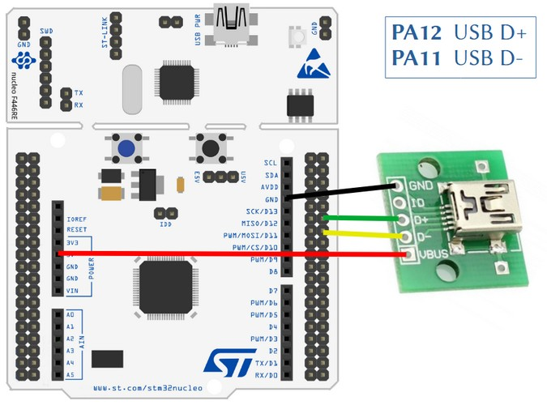
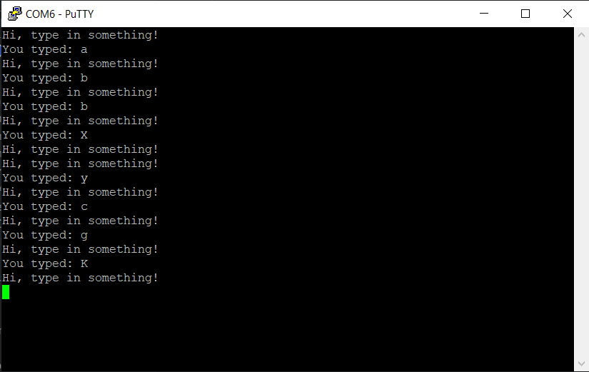

# USBSerial demo
## project name: mbed6_usbSerial
Tested by: **Keil Studio** 1.50 and **Mbed-OS** 6.16.0

The **USBSerial** class emulates a basic serial port over USB and provides 
printf functionality similarly to the Serial class. In this example we use the ```getc()``` 
function for character input, and the ```print()``` function for formatted output.

### Reference: 
[USBSerial class reference](https://os.mbed.com/docs/mbed-os/v6.15/apis/usbserial.html) (Mbed user guide)

## Hardware requirements
* NUCLEO-F446RE development board
* USB conncetor breakout for the STM32F446RE USBFS channel
* USB connection to a PC through the built-in ST-Link v2-1

## Wiring instructions for the NUCLEO-F446RE board

There is no USB connector for the USBFS channel of the target CPU therefore we have to prepare connection
by using an USB cable and an USB socket breakout card.

| USB breakout  | NUCLEO-F446RE pin   |
|:-------:|:-----: |
|  GND    |GND     | 
|  ID     | --     | 
|  D+     | PA_12  |
|  D-     | PA_11  | 
|  VBUS   | 5V     | 





## Software requirements
* Start with an empty mbed 6 project
* Edit the main.cpp source file
* Configure the project by adding an **mbed_app.json** file in which
    * We have to configure **usb_speed** parameter
    * We have to add **USBDEVICE** to the device list of the target

Finally the **mbed_app.json** sholuld look like this: 

```
{
    "config": {
        "usb_speed": {
            "help": "USE_USB_OTG_FS or USE_USB_OTG_HS or USE_USB_HS_IN_FS",
            "value": "USE_USB_OTG_FS"
        }
    },
    "target_overrides": {
        "*": {
            "target.device_has_add": ["USBDEVICE"]
        }
    }
}
```
## mbed6_usbSerial results
Open a terminal window for the new virtual serial port on the PC which the target USB is connected to. 
The baudrate setting has no effect for the USB transfer, so the default values is good as well. 
After (re)starting the program type in something
then you should see something similar to the following output:



